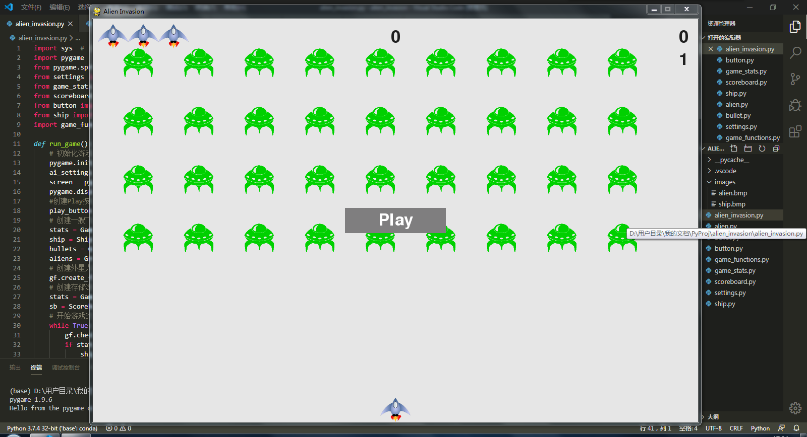

# alien_invasion
Here is the recording of a simple pygame's demo, named alien invasion.
- The first commit 2020-2-10 21:40 
  ### What we do?
  - Create three py files, including alien_invasion.py, ship.py, setting.py.
  - Make a project including above files and an images floder containing a cute ship's bmp file.
  ### What can we do?
  - Actually, nothing can we do, but a ship shown on the center-bottom screen.
  - But today is the first day right? It will be fine.

- 第二版（2020-2-12）
  - 增加了飞船移动、子弹射击、外星人批量生产与移动等功能。
  - 除了按键，暂未作任何交互。

- 第三版（2020-2-13）
  - 增加了交互。
  - 增加了level等级，并随等级增加外星人下降速度。
  - 增加了计分板，显示当前得分和最高得分。
  - 增加了图形化显示剩余飞船数
  
  pygame的小项目告一段落，以后可能会继续修改吧，400多行代码，着实锻炼了工程及多文件编程能力，开心。
  
  
